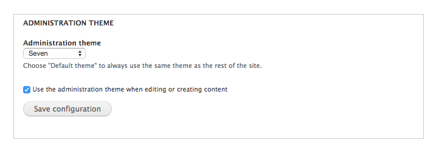

# Exercise: Change the default administrative theme

Best practice during theme development is to ensure you have a stable administration theme should anything go awry while working on your site’s design. 

* **Step 1**: In the Toolbar, click on Appearance. Scroll down to the section labeled “Administration theme” and set the administration theme.  Notice you can choose whether to use this theme for content creation as well. Notice how now the theme changes when you go to a path beginning with /admin.

* **Step 2**: Look at the blocks administration page (Click Structure, then Blocks). Configure blocks for your admin theme. If your admin theme is not enabled, it will not show up as a tab on the blocks administration page.

**Contributed Admin Themes**:
Drupal core comes with an admin theme called Seven. At this time, very few Drupal 8 admin themes are production ready. 
