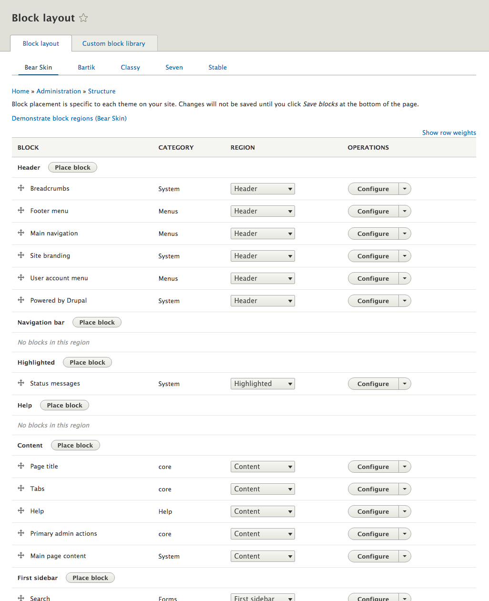

# Exercise: Explore the Block System

Look at the blocks administration page (admin/structure/block).



Each theme can have its own block configuration (you can switch from one theme to another within this page).

In this screenshot, we can see the blocks enabled for bear_skin, placed in the regions we defined in ```bear_skin.info.yml```. To add a block you don't see yet, you must choose a region a click the "Place block" button. From there you'll access an overlay that allows you to pick from all blocks available (core blocks, views blocks etc). 

Additionally, each block you have its own configuration (tile, access) and visibility settings (for instance, if you only want the block to show on the home page, or for a specific content type).