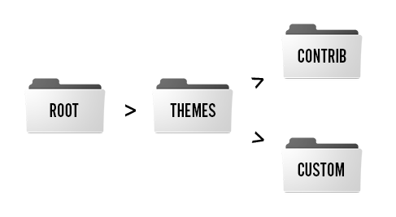

# How does theming work?

When a page is requested from a Drupal site, the PHP code in Drupal’s core files gets the relevant data from the database as needed while it runs through all of its logic and prepares data for display as HTML. As it does this it also interacts with contributed modules which similarly can get and prepare data. Drupal’s core and contributed modules render sections of generated HTML/TWIG and CSS/JS files, doing a good bit of front-end work on their own. The theme mainly overrides and enhances the way the data is prepared for display and can add CSS and JS files of its own. These overrides happen on the CSS level as well as on the HTML/TWIG templating level. The job of the Drupal themer is to work with CSS and JS files and to customize the markup through Twig templates overrides and preprocesses in order to match a design.  

On the file level, each theme is a directory named uniquely with a machine name (underscores and letters only).  This name should not match the name of any module used on the site. Custom and contributed themes belong in your site’s /themes directory, and core themes, which should not be altered, are in the /core/themes directory.

