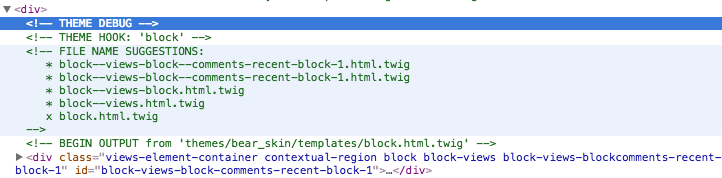

# Exercise: Overriding Views Templates

Views templates are very similar to core templates, and have their own naming conventions based on their target. Templates can be specific to a given view, a particular field, an entire display style, or any combination of those. Views now ship with Drupal Core, so let's dive right in.

**Step 1**: Place the Recent Comments block in a region.

Views provides several default views as examples. One example is Recent Comments (comments_recent), which creates both a block displaying the most recent comments with a link to the node. This view is enabled by default. You need to have the comment module enabled and to have some comments on the site.

**Step 2**: Explore the possible templates

As we have turned on twig debug in a previous step, we have template suggestions available in our source code as comments. 

These suggestions appear in order of the override granularity. ex: block--views.html.twig will override all blocks generated by your views. In this case we want to override this specific bock only, so we will target the top suggestion.

Create your block--views-block--comments-recent-block-1.html.twig and place it in the templates folder. 