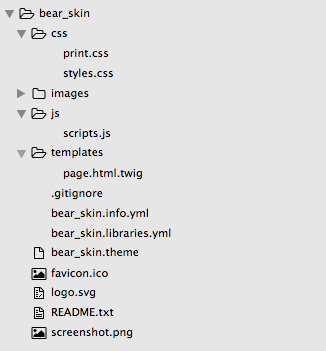

# Review: Anatomy of a theme

For the purposes of this session to see how the Drupal theme system works, we created a theme from scratch. In practice, however, this is not how many developers use the theme layer in Drupal. In the next session, we will see how to use a popular starter theme to quickly set up a custom theme.

Now you have a hands-on understanding of the anatomy of a Drupal theme.

**.info.yml** 
This is the only required file of a theme. It defines the theme name, its regions, stylesheets, and other options. Each line defines an option as a key-value pair (key = value). Values not specified will use Drupal’s default.

**.theme file** 
The file where you will write your preprocesses in order to override Drupal functions and modify the output. It is always recommended to modify the logic of your elements (if statements etc) in this fie as opposed to writing them in a template file. This allow better maintenance and collaboration. 

**Template files** 
These files end in *.html.twig  
The files contain the markup for a specific element. Duplicating a core file and placing it within a "template" folder in your theme will allow you to override the default Drupal markup.

**CSS files** 
Files need to be listed in the .libraries.yml file or included elsewhere with code. Multiple files can be created to keep things organized and modular.
Use folders to organize your CSS files as well.
Many people use sass and a pre-processor nowadays. scss files need to follow the same  structure to keep things well organized.

**JS files** 
Files need to be listed in the .libraries.yml file or included elsewhere with code as well.

**Images** 
Image files that are specific to the theme (background images, SVG, sprites etc) should be kept within the theme in an images folder

Images that are not specific to the theme (photo placed inline in a node body, etc) should not be placed in the theme, but should be handled by the Drupal user interface.

At this time our theme structure should look like this.

